## Schedule for today

Time|What's happening
-------|-------
19:00|doors open
19:30|Konstantin Greger ([@kogreger](https://twitter.com/kogreger)): "Welcome address and brief group introduction"
~19:45|Berry Boessenkool (Universität Potsdam, [@berryboessenkoo](https://twitter.com/berryboessenkoo)): "Why you need an umbrella on hot days - R application in hydrometeorological data analysis"
~20:15|Daniel Kirsch ([@kirel](https://twitter.com/kirel)): "Analyzing children's relay times for fun and... gold medals"
afterwards|socializing & networking
22:00|doors close


--- .class #id &twocol

## Our group sponsors

*** =left

 

*** =right

 


--- .class #id 

## Number of group members

 

--- .class #id 

## Ratio of meetup attendance registration


#### (Source: meetup.com, current number of group members = ``184``)

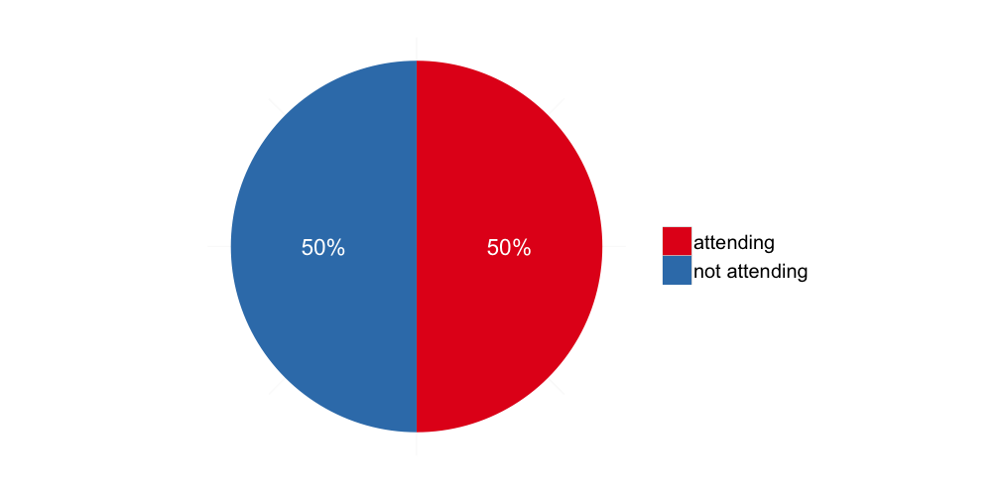 

--- .class #id

## "I'd go to a group meeting""


#### (Source: BerlinRUG member survey, n = ``35``)

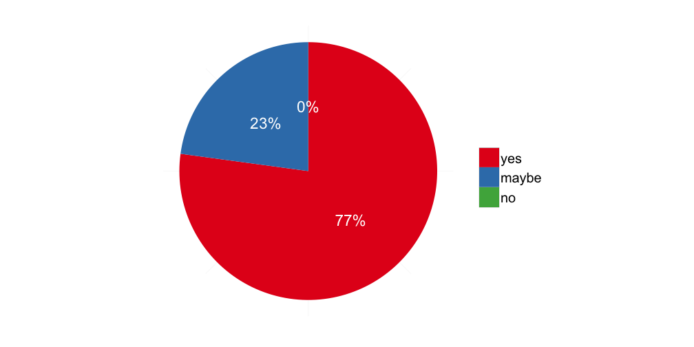 

--- .class #id

## "I would present something myself one day"


#### (Source: BerlinRUG member survey, n = ``34``)

 

--- .class #id

## "I'd like to have the talks at the meetings be recorded"


#### (Source: BerlinRUG member survey, n = ``32``)

 

--- .class #id

## "I'd like to have the talks at the meetings be live streamed"


#### (Source: BerlinRUG member survey, n = ``31``)

 

--- .class #id

## "Group meetings would work best for me on ..."


#### (Source: BerlinRUG member survey, n = ``30``)

 

--- .class #id

## "Group meeting should start ..."


#### (Source: BerlinRUG member survey, n = ``34``)

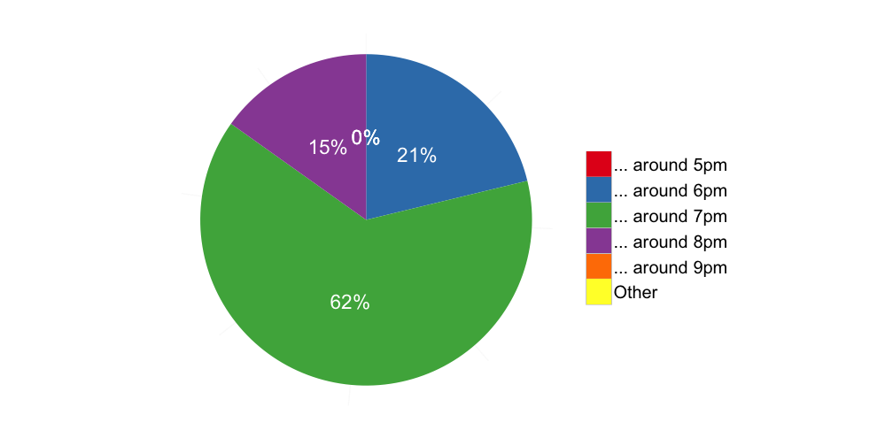 

--- .class #id

## "Group meetings should be ..."


#### (Source: BerlinRUG member survey, n = ``32``)

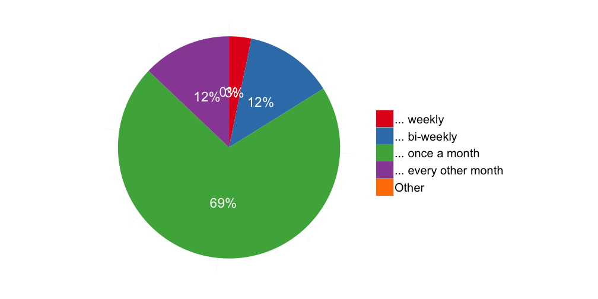 

--- .class #id

## "Group meetings would be most interesting for me if ..."


#### (Source: BerlinRUG member survey, n = ``35``)

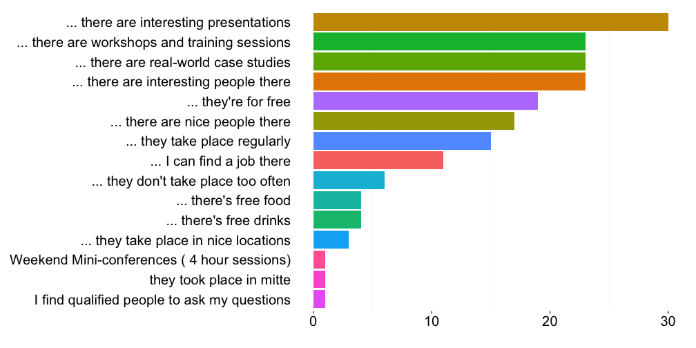 

--- .class #id

## "My field of work/research"


#### (Source: BerlinRUG member survey, n = ``35``)

 

--- .class #id

## "I'm ..."


#### (Source: BerlinRUG member survey, n = ``35``)

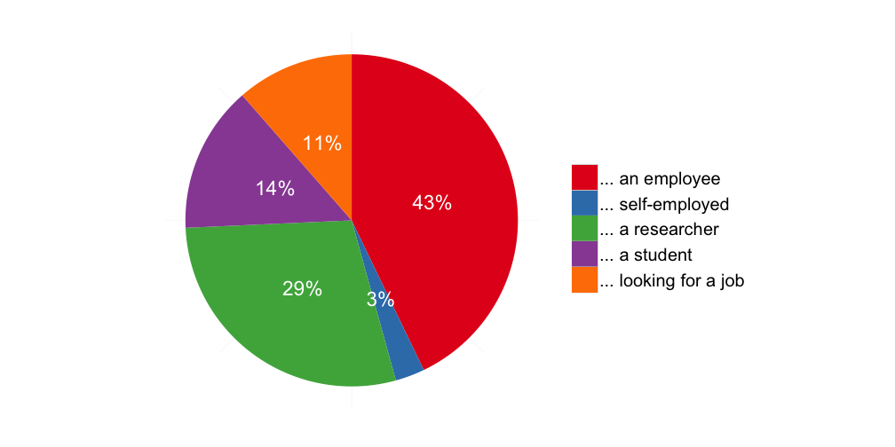 

--- .class #id

## "I'm using R ..."


#### (Source: BerlinRUG member survey, n = ``34``)

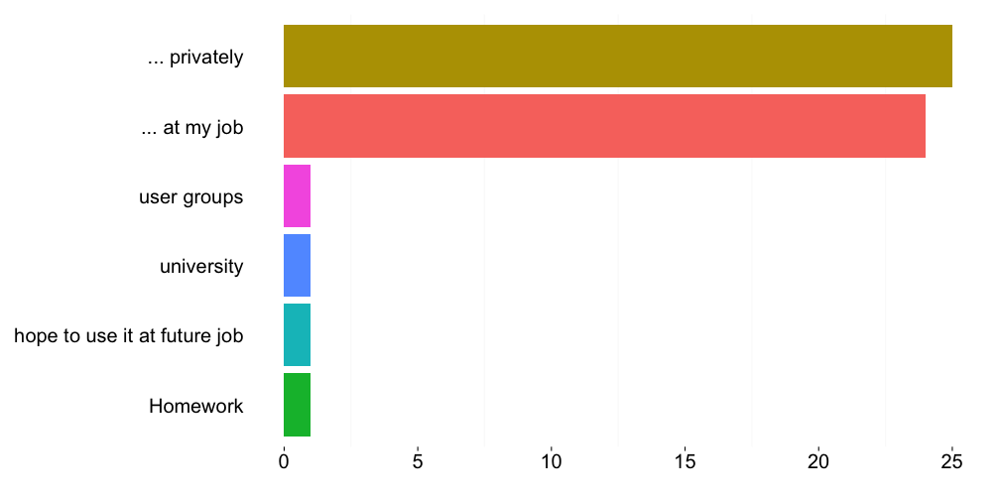 

--- .class #id 

## "My R proficiency level"


#### (Source: BerlinRUG member survey, n = ``35``)

 

--- .class #id

## "My highest degree"


#### (Source: BerlinRUG member survey, n = ``35``)

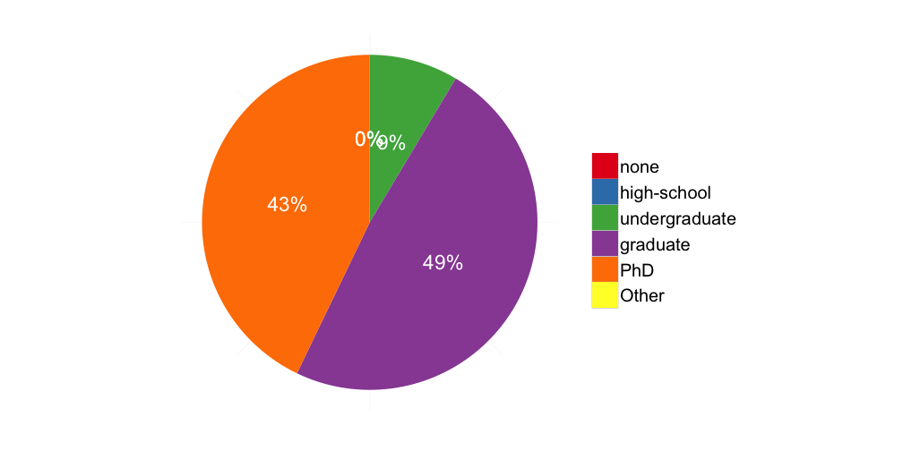 

--- .class #id

## "My english proficiency"


#### (Source: BerlinRUG member survey, n = ``34``)

 

--- .class #id

## "My other language skills"


#### (Source: BerlinRUG member survey, n = ``32``)

 

--- .class #id

## "I have been living in Berlin ..."


#### (Source: BerlinRUG member survey, n = ``35``)

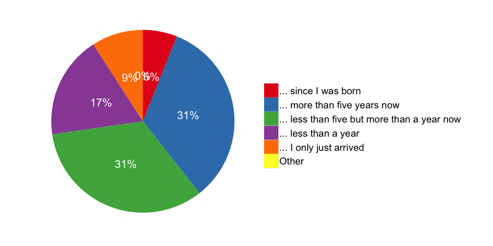 

--- .class #id

## You are the group - the group is you!
##### (image credit: [Peter O'Connor aka anemoneprojectors on Flickr](https://flic.kr/p/9GEQsk))

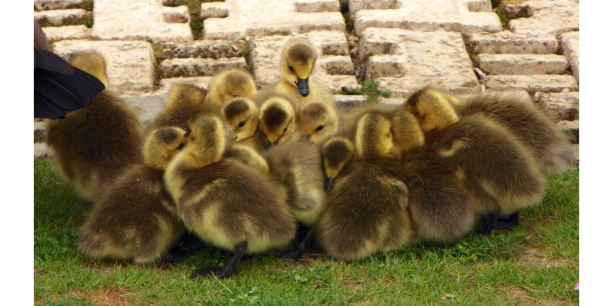 

--- .class #id 

## Contact

* Group website on Meetup.com: [http://www.meetup.com/Berlin-R-Users-Group/](http://www.meetup.com/Berlin-R-Users-Group/)
* Twitter: [@BerlinRUG](https://twitter.com/berlinrug)
* Konstantin: [@kogreger](https://twitter.com/kogreger) or [kogreger@gmail.com](mailto:kogreger@gmail.com)
* Member Survey: [http://bit.ly/BerlinRUG_Member_Survey](http://bit.ly/BerlinRUG_Member_Survey) (so far 46 hits, 34 submitted)
* These slides are available on my [GitHub repository ```berlinrug_introduction```](https://github.com/kogreger/berlinrug_introduction)

--- .class #id 

## Start
##### (image credit: [Dirk Vorderstraße on Flickr](https://flic.kr/p/h8fWVM))

 

--- .class #id 

## Schedule for today

Time|What's happening
-------|-------
19:00|doors open
19:30|Konstantin Greger ([@kogreger](https://twitter.com/kogreger)): "Welcome address and brief group introduction"
~19:45|Berry Boessenkool (Universität Potsdam, [@berryboessenkoo](https://twitter.com/berryboessenkoo)): "Why you need an umbrella on hot days - R application in hydrometeorological data analysis"
~20:15|Daniel Kirsch ([@kirel](https://twitter.com/kirel)): "Analyzing children's relay times for fun and... gold medals"
afterwards|socializing & networking
22:00|doors close

--- .class #id 

## Backup slides

--- .class #id

## "My gender"


#### (Source: BerlinRUG member survey, n = ``35``)

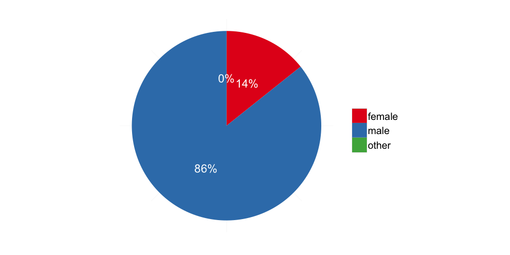 

--- .class #id

## "My age"


#### (Source: BerlinRUG member survey, n = ``35``)

 
