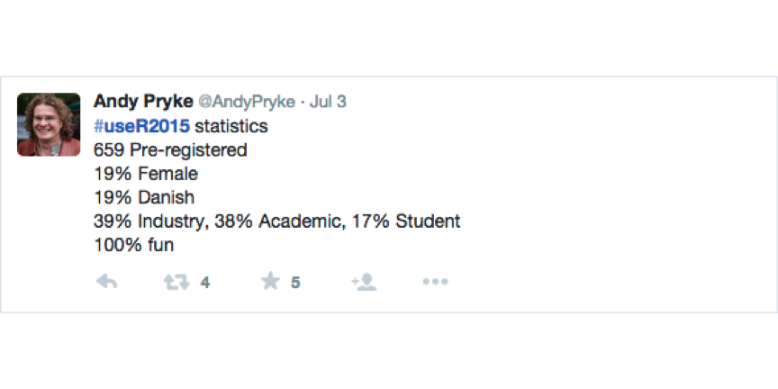

## Schedule for today

Time|What's happening
-------|-------
19:00|doors open
19:15|Konstantin Greger ([@kogreger](https://twitter.com/kogreger)): "Welcome address and brief introduction"
19:20|Berry Boessenkool ([@berryboessenkoo](https://twitter.com/berryboessenkoo)): "Shiny Apps for Interactive Graphics"
19:35|Rick Scavetta ([@Rick_Scavetta](https://twitter.com/rick_scavetta)): "Some New Data Vis Tools in R - visR! 2015"
19:50|Konstantin Greger ([@kogreger](https://twitter.com/kogreger)): "Spatial Analysis in R"
from ~20:05|socializing & networking
22:00|doors close

--- .class #id &twocol

## Our group sponsors

*** =left

 

*** =right

 

--- .class #id 

## Number of group members

 

--- .class #id 

## distributed matters @Berlin (Sept 18-19)

10th anniversary event of NoSQL matters. Adding several new topics to the theme and rebranding to distributed matters.
The conference covers topics like: Distributed systems, Microservices, DCOS, Cloud Management, Database solutions, DevOp operations and, of course, NoSQL and Big Data.

Training day (18.09.15) -> [http://bit.ly/BERtrainigs](http://bit.ly/BERtrainigs)
Conference day (19.09.15) -> [http://bit.ly/BER_Home](http://bit.ly/BER_Home)
 
Conference day will be opened by the legendary KYLE KINGSBURY ([@aphyr](https://twitter.com/aphyr) - the author of “Call Me Maybe” project).
Followed by Salvatore Sanfilippo (Pivotal), Charity Majors (Parse / Facebook), Oliver Hardt (Bitly), Joe Nash (Braintree/PayPal) and more.
 
Get your special discounted Early Bird ticket (1 day conf) or Early Bird Combi (training day + conf) until 26th July 2015 -> [http://bit.ly/BERtickets](http://bit.ly/BERtickets)
 
After 26th July use the code "BerlinR_UG_2015"" to get 20% off.

!! Raffle for 1 FREE TICKET for BerlinRUG members -> send message to [Konstantin](mailto:kogreger@gmail.com) by 31st July to be eligible !!

--- .class #id 

## EARL 2015 Conference London (Sept 14-16)

Effective Applications of the R Language

2015 Keynote Speakers: Alex Bellos, Joe Cheng, Dirk Eddelbuettel and Hannah Fry

Register at [http://www.earl-conference.com/](http://www.earl-conference.com/) and follow [@earlconf](https://twitter.com/earlconf)

--- .class #id

## useR! Conference 2015

 

More stats and insights in [excellent blog post by Torben Tvedebrink (chair of local committee, useR! 2015)](http://blog.revolutionanalytics.com/2015/07/planning-of-and-some-stats-from-user-2015-aalborg.html)

--- .class #id 

## On R User Groups

Joe Rickert (Microsoft): [*"R User Groups - Building Community at the Local Level"*](http://user2015.math.aau.dk/presentations/121.pdf)

What does it take for a group of people to be a community?
* Intentional involvement
* A shared set of positive goals
* Interactions that take place over time
* Committed members
* Contributions to the general welfare

Thomas Lumley (R Core): "R is a free software *community* for statistical computing and graphics"

--- .class #id 

## Schedule for today

Time|What's happening
-------|-------
19:00|doors open
19:15|Konstantin Greger ([@kogreger](https://twitter.com/kogreger)): "Welcome address and brief introduction"
19:20|Berry Boessenkool ([@berryboessenkoo](https://twitter.com/berryboessenkoo)): "Shiny Apps for Interactive Graphics"
19:35|Rick Scavetta ([@Rick_Scavetta](https://twitter.com/rick_scavetta)): "Some New Data Vis Tools in R - visR! 2015"
19:50|Konstantin Greger ([@kogreger](https://twitter.com/kogreger)): "Spatial Analysis in R"
from ~20:05|socializing & networking
22:00|doors close
