# <em>useR!</em> 2015:<br>Data Vis Highlights
Rick Scavetta<br>rick.scaetta@science-craft.com<br>@Rick_Scavetta  
23 July 2015  


## Data Vis Highlights from useR! 2015

* tessera
    + Interactive plotting for large, complex data
* tmap
    + Thematic maps
* oaPlots
    + Density-plot-type legends
* dendextend
    + Dendrograms
* plotROC
    + Interactive ROC plots


## Tessera

- http://tessera.io

Consists of two main packages:

* datadr
    + Divide & Recombine paradigm 
    + Parallel data and processing back-ends (Hadoop and Spark)
    + A simple consistent interface

* trelliscope
    + Flexible, detailed, scalable visualization of large, complex data


## datadr

* Fundamentally, all data types are stored in a back-end as key/value pairs

* Data type abstractions on top of the key/value pairs
    + Distributed data frame (ddf):
      + A data frame that is split into chunks
      + Each chunk contains a subset of the rows of the data frame
      + Each subset may be distributed across the nodes of a cluster

## Housing Data Example  


```r
# look at housing data
str(housing)
```

```
## 'data.frame':	224369 obs. of  7 variables:
##  $ fips            : Factor w/ 3235 levels "01001","01003",..: 187 187 187 187 187 187 187 187 187 187 ...
##  $ county          : Factor w/ 1969 levels "Abbeville County",..: 17 17 17 17 17 17 17 17 17 17 ...
##  $ state           : Factor w/ 57 levels "AK","AL","AR",..: 6 6 6 6 6 6 6 6 6 6 ...
##  $ time            : Date, format: "2008-10-01" "2008-11-01" ...
##  $ nSold           : num  NA NA NA NA NA NA NA NA NA NA ...
##  $ medListPriceSqft: num  308 299 NA 290 288 ...
##  $ medSoldPriceSqft: num  326 NA 318 306 292 ...
```

## Divide

- Divide the housing data set by the variables "county" and "state"
    - Akin to dplyr::group_by()
- Creates a distributed data frame (ddf)


```r
# divide by county and state
byCounty <- divide(housing, by = c("county", "state"), update = TRUE)
```

```
## * Running map/reduce to get missing attributes...
```

```r
class(byCounty)
```

```
## [1] "ddf"      "ddo"      "kvMemory"
```


## Each subset of the ddf has a key


```r
byCounty[[1]]
```

```
## $key
## [1] "county=Abbeville County|state=SC"
## 
## $value
##    fips       time nSold medListPriceSqft medSoldPriceSqft
## 1 45001 2008-10-01    NA         73.06226               NA
## 2 45001 2008-11-01    NA         70.71429               NA
## 3 45001 2008-12-01    NA         70.71429               NA
## 4 45001 2009-01-01    NA         73.43750               NA
## 5 45001 2009-02-01    NA         78.69565               NA
## ...
```

## Trelliscope
- Divide and recombine visualization tool
- Based on Trellis display
- Apply a visualization method to each subset of a ddf or ddo
- Interactively sort and filter plots
- Define a function to apply to each subset that creates a plot
    - Plots can be created using base R graphics, ggplot, lattice, rbokeh, conceptually any htmlwidget

## Make a panel function

```r
# medListPriceSqft and medSoldPriceSqft by time
timePanel <- function(x) xyplot(medListPriceSqft + medSoldPriceSqft ~ 
    time, data = x, auto.key = TRUE, ylab = "$ / Sq. Ft.")
# test the panel function on one division
head(byCounty[[1]][[2]], 6)
```

```
##    fips       time nSold medListPriceSqft medSoldPriceSqft
## 1 45001 2008-10-01    NA         73.06226               NA
## 2 45001 2008-11-01    NA         70.71429               NA
## 3 45001 2008-12-01    NA         70.71429               NA
## 4 45001 2009-01-01    NA         73.43750               NA
## 5 45001 2009-02-01    NA         78.69565               NA
## 6 45001 2009-03-01    NA         76.38889               NA
```

```r
class(byCounty[[1]][[2]])
```

```
## [1] "data.frame"
```

## Test the panel function on one panel

```r
timePanel(byCounty[[1]][[2]])
```

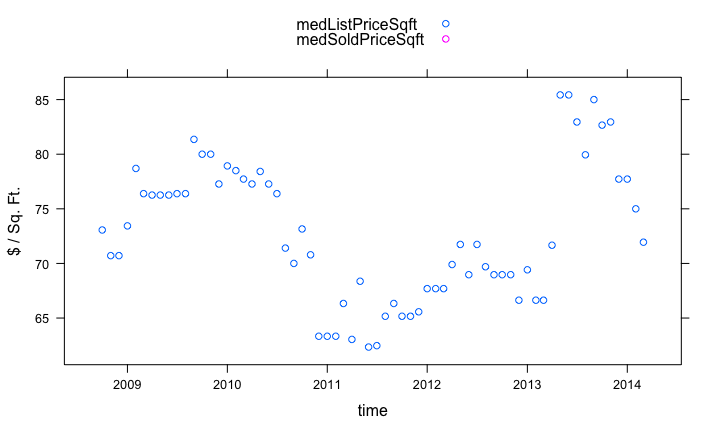 

## make a cognostics function

```r
# slope of fitted line of list price for each county
lmCoef <- function(x)
  coef(lm(medListPriceSqft ~ time, data = x))[2]
  
priceCog <- function(x) { list(
  slope = cog(lmCoef(x), desc = "list price slope"),
  meanList = cogMean(x$medListPriceSqft),
  listRange = cogRange(x$medListPriceSqft),
  nObs = cog(sum(!is.na(x$medListPriceSqft)),
             desc = "number of non-NA list prices")
)}
```

## Test the cognostics function on one panel

```r
priceCog(byCounty[[1]][[2]])
```

```
## $slope
##          time 
## -0.0002323686 
## 
## $meanList
## [1] 72.76927
## 
## $listRange
## [1] 23.08482
## 
## $nObs
## [1] 66
```

## Visualization database (vdb)
- Trelliscope creates a directory with all the data to render the plots
- Can later re-launch the Trelliscope display without all the prior data analysis


```r
vdbConn("housing_vdb", autoYes = TRUE)
```

## Make a display


```r
makeDisplay(byCounty,
   name = "list_sold_vs_time_datadr",
   desc = "List and sold price over time",
   panelFn = timePanel,
   width = 400, height = 400,
   lims = list(x = "same")
)

view()
```

## tmap package for thematic maps

A ggplot-like plotting plackage for thematic maps:


```r
library(tmap)
data(Europe)
qtm(Europe)
```

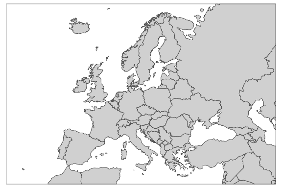

## quick plot for thematic maps


```r
qtm(Europe,
    fill = "gdp_cap_est",
    text = "iso_a3",
    text.size = "AREA",
    root = 5,
    fill.title = "GDP per capita", 
    fill.textNA = "Non-European countries",
    theme = "Europe")
```

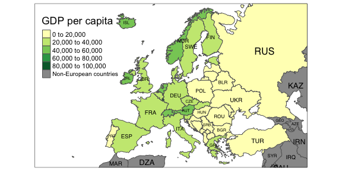

## tmap Elements

Plotting with tmap elements

The main plotting method, the equivalent to ggplot2's ggplot, consists of elements that start with tm_. The first element to start with is tm_shape, which specifies the shape object. Next, one, or a combination of the following drawing layers should be specified:

- tm_fill
- tm_borders
- tm_bubbles
- tm_lines
- tm_lines
- tm_text
- tm_grid
- tm_credits	
- tm_scale_bar

## Flexible way


```r
tm_shape(Europe) +
    tm_fill("gdp_cap_est", 
            textNA="Non-European countries", 
            title="GDP per capita")
```

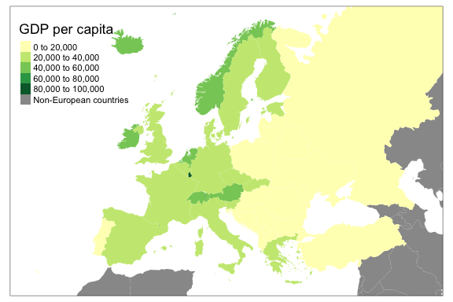

## Flexible way


```r
tm_shape(Europe) +
    tm_fill("gdp_cap_est",
            textNA="Non-European countries",
            title="GDP per capita") +
    tm_borders()
```

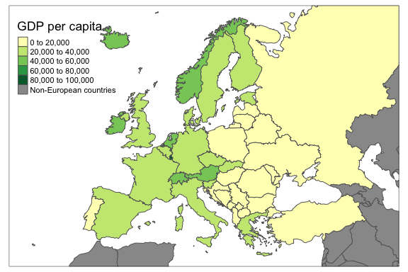

## Flexible way


```r
tm_shape(Europe) +
    tm_fill("gdp_cap_est",
            textNA="Non-European countries", 
            title="GDP per capita") +
    tm_borders() +
    tm_text("iso_a3", size="AREA", root=5)
```

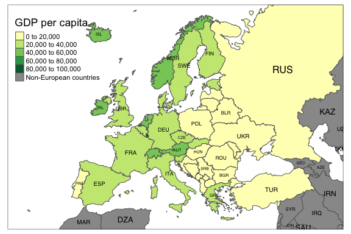

## Flexible way


```r
tm_shape(Europe) +
    tm_fill("gdp_cap_est", 
            textNA="Non-European countries", 
            title="GDP per capita") +
    tm_borders() +
    tm_text("iso_a3", size="AREA", root=5) + 
    tm_layout_Europe()
```

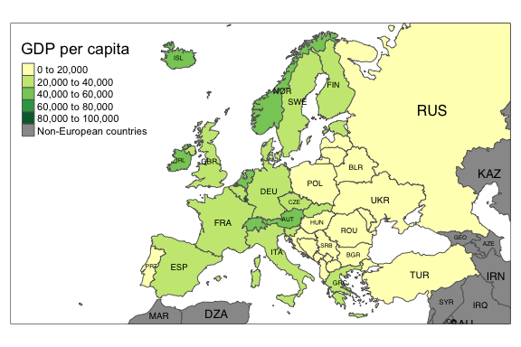

## Adding points

- Use the metro data set:
    - Spatial data of metropolitan areas, of class SpatialPointsDataFrame.
    - Includes a population times series from 1950 to (forecasted) 2030.
    -  All metro areas with over 1 million inhabitants in 2010 are included.

##

```r
data(metro)

tm_shape(metro) +
    tm_bubbles("pop2010", "red", alpha = 0.5, size.lim = c(0, 11e6), 
               sizes.legend = seq(2e6,10e6, by=2e6), title.size="Metropolitan Population")
```

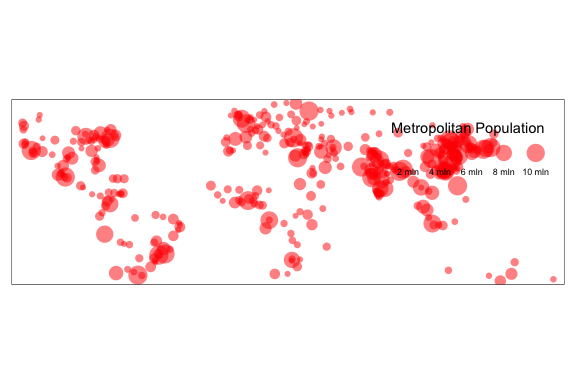

##

```r
tm_shape(metro) +
    tm_bubbles("pop2010", "red", alpha = 0.5, size.lim = c(0, 11e6), 
               sizes.legend = seq(2e6,10e6, by=2e6), title.size="Metropolitan Population") +
    tm_text("name", size="pop2010", scale=1, ymod=-.02, root=4, size.lowerbound = .60) 
```

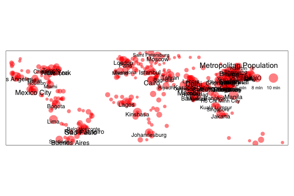

##

```r
tm_shape(Europe) +
    tm_fill("pop_est_dens", style="kmeans", textNA="Non-European countries", 
    title="Country population density (per km2)") +
    tm_borders() +
    tm_text("iso_a3", size="area", scale=1.5, root=8, size.lowerbound = .40,
            fontface="bold", case=NA, fontcolor = "gray35")
```

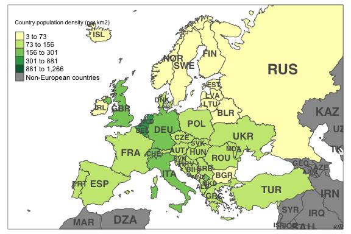

##

```r
tm_shape(Europe) +
    tm_fill("pop_est_dens", style="kmeans", textNA="Non-European countries", 
    title="Country population density (per km2)") +
    tm_borders() +
    tm_text("iso_a3", size="area", scale=1.5, root=8, size.lowerbound = .40,
            fontface="bold", case=NA, fontcolor = "gray35") +
tm_shape(metro) +
    tm_bubbles("pop2010", "red", alpha = 0.5, size.lim = c(0, 11e6), 
               sizes.legend = seq(2e6,10e6, by=2e6), title.size="Metropolitan Population") +
  tm_layout_Europe()
```

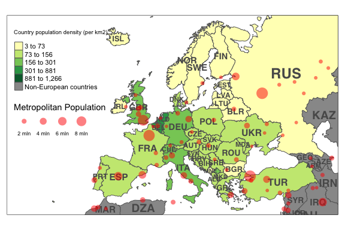

## Density plots legends

```r
install.packages("oaPlots", repos = "http://repos.openanalytics.eu", 
    type = "source")
```


```r
library(oaPlots)

# dsub is a subset of the diamonds data frame

# define color pallette, color vector and color region breaks
colorPalette <- brewer.pal(9, "Blues")[4:9] # RColorBrewer function
colorObj <- splitColorVar(colorVar = dsub$z, colorPalette) # oaPlots function
colorVec <- colorObj$colorVec
breaks <- colorObj$breaks

# plot the data
prepLegend(side = "right", proportion = 0.3) # oaPlots function
oaTemplate(xlim = range(dsub$x), ylim = range(dsub$y),
           xlab = "X", ylab = "Y") # oaPlots function
points(x = dsub$x, y = dsub$y, col = colorVec, pch = 19, cex = 0.6)
# add the legend
densityLegend(x = dsub$z, colorPalette = colorPalette, side = "right",
              main = "Z", colorBreaks = breaks)
```

##
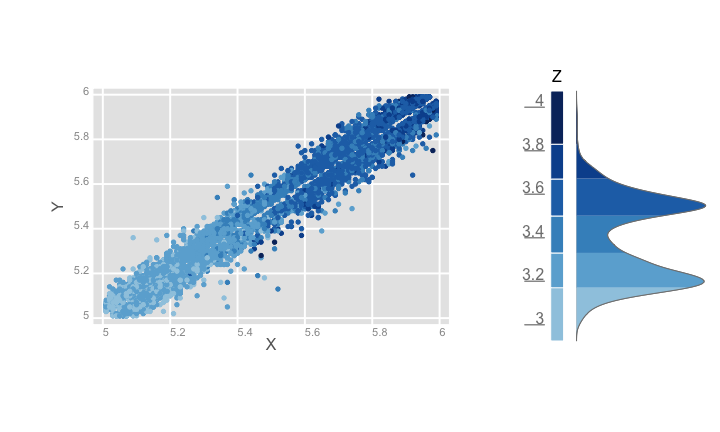

## Dendrograms

```
## 
## Welcome to dendextend version 1.1.0
## 
## Type ?dendextend to access the overall documentation and
## browseVignettes(package = 'dendextend') for the package vignette.
## You can execute a demo of the package via: demo(dendextend)
## 
## More information is available on the dendextend project web-site:
## https://github.com/talgalili/dendextend/
## 
## Contact: <tal.galili@gmail.com>
## Suggestions and bug-reports can be submitted at: https://github.com/talgalili/dendextend/issues
## 
## 			To suppress the this message use:
## 			suppressPackageStartupMessages(library(dendextend))
## 
## 
## Attaching package: 'dendextend'
## 
## The following object is masked from 'package:datadr':
## 
##     %>%
## 
## The following object is masked from 'package:stats':
## 
##     cutree
```


```r
library(dendextend)
```


```r
dend <- c(1:5) %>% 
            dist %>% 
            hclust("ave") %>% 
            as.dendrogram

plot(dend)
```

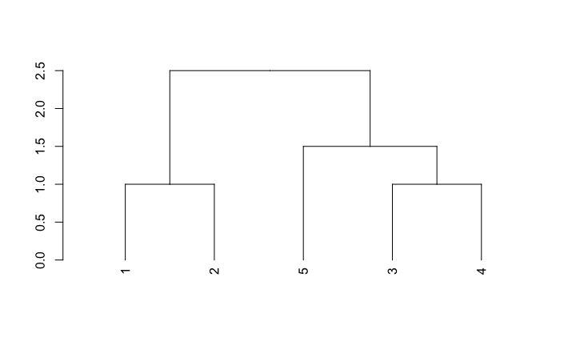

##

```r
# Labels
labels(dend) <- c("A", "B", "extend", "dend", "C")
# Label colors
labels_colors(dend) <- rainbow(5)
plot(dend)
```

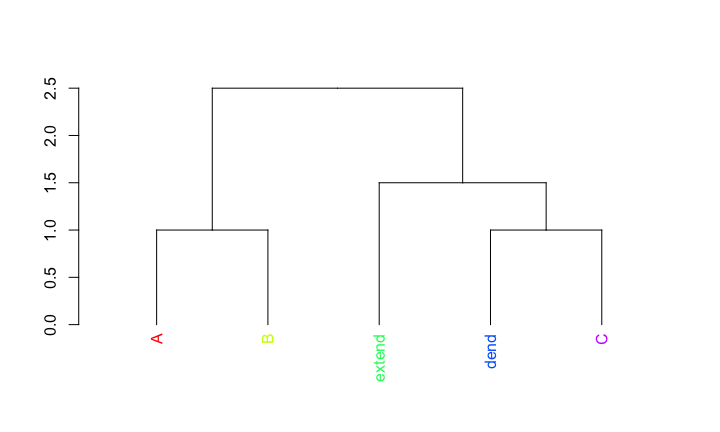

## 

```r
dend <- color_branches(dend, k = 2)
plot(dend)
dend2 <- sort(dend)
plot(dend2)
```

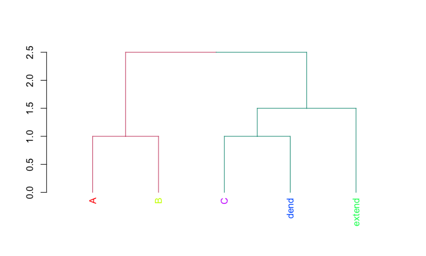

## 

```r
tanglegram(dend, dend2)
```

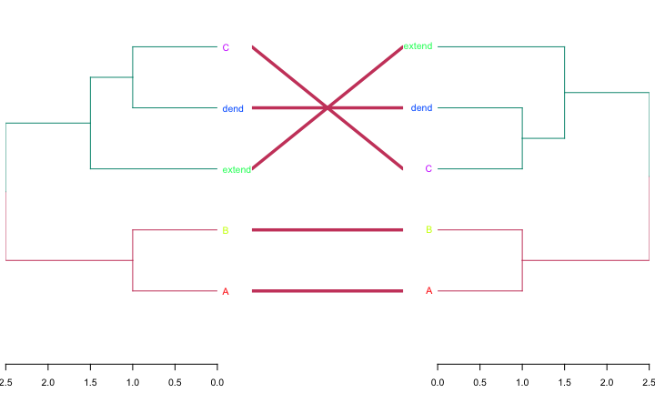

## Interactive ROC curves


```r
library(plotROC)
shiny_plotROC()
```


## test


```r
print(Cervantes)
```

```
## [1] "Facts are the enemy of truth"
```
