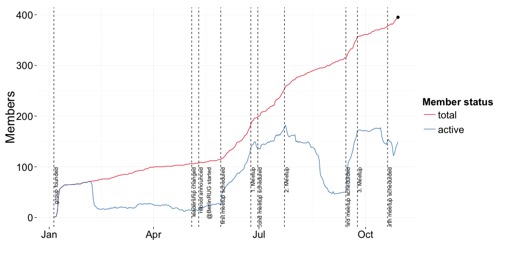
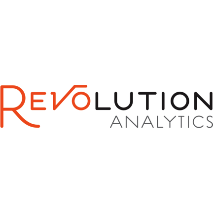
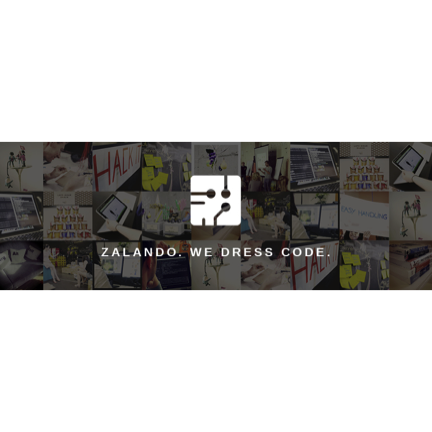

## Schedule for today

Time|What's happening
-------|-------
18:30|doors open
19:15|Konstantin Greger ([@kogreger](https://twitter.com/kogreger)): "Welcome and Brief Introduction"
19:20|Hayley Baldwin ([@ZalandoTech](https://twitter.com/zalandotech)): "Welcome to Zalando Tech"
19:25|Open Mic!
19:30|Nicolas Bell (Zalando Tech SE; [@niknik](https://twitter.com/niknik)): "Product Discovery with R"
20:00|Eduard Parsadanyan: "[Unfulfilled?] Potential of R in Clinical Trials"
from ~20:25|socializing & networking
21:00|doors close

--- .class #id 

## Number of group members

 

--- .class #id 

## Call for Presenters

time series analysis, own packages, modelling count variables, binary logistic modelling with R, data manipulation with dplyr (with magrittr), data visualization with ggvis, making maps with R, introduction to survival analysis with R, logistic regression modelling with R - beyond binary (multinomial and ordinal logistic regression), shiny dashboard, propensity score matching studies, dplyr, ggvis, possibly some of the work I've done with web scraping, network analysis, information visualization, maps and spatial analysis in R, R in the social sciences, basic introduction to dplyr, data mining in R, ODE based models of phytoplankton growth, overview of glmnet, applications of using R in my job environment, R introductionary course, writing functions in R is actually fairly easy, R + knitr + LaTeX: much stronger than Office Word (claim and proof), *apply is the best thing since sliced bread, why you should write a package - and how, modelling election outcomes, discrete choice modeling, bayesian statistics, quantitative marketing/economics, reproducibility in environmental modelling

Just contact me: [kogreger@gmail.com](mailto:kogreger@gmail.com)

--- .class #id 

## Important Links

Participate in our group survey here: [http://bit.ly/BerlinRUG_Member_Survey](http://bit.ly/BerlinRUG_Member_Survey)

Have a look at our group repository here: [http://kogreger.github.io/BerlinRUG](http://kogreger.github.io/BerlinRUG)

--- .class #id &twocol

## Our group sponsors

*** =left

 

*** =right

 

--- .class #id bg:url(./assets/img/openmic.jpg)

## Open Mic!

"SennMicrophone" by ChrisEngelsma - Own work. Licensed under CC BY-SA 3.0 via Commons https://commons.wikimedia.org/wiki/File:SennMicrophone.jpg#/media/File:SennMicrophone.jpg

--- .class #id 

## Schedule for today

Time|What's happening
-------|-------
18:30|doors open
19:15|Konstantin Greger ([@kogreger](https://twitter.com/kogreger)): "Welcome and Brief Introduction"
19:20|Hayley Baldwin ([@ZalandoTech](https://twitter.com/zalandotech)): "Welcome to Zalando Tech"
19:25|Open Mic!
19:30|Nicolas Bell (Zalando Tech SE; [@niknik](https://twitter.com/niknik)): "Product Discovery with R"
20:00|Eduard Parsadanyan: "[Unfulfilled?] Potential of R in Clinical Trials"
from ~20:25|socializing & networking
21:00|doors close
